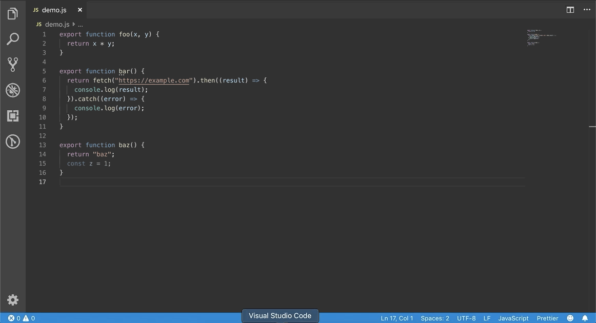
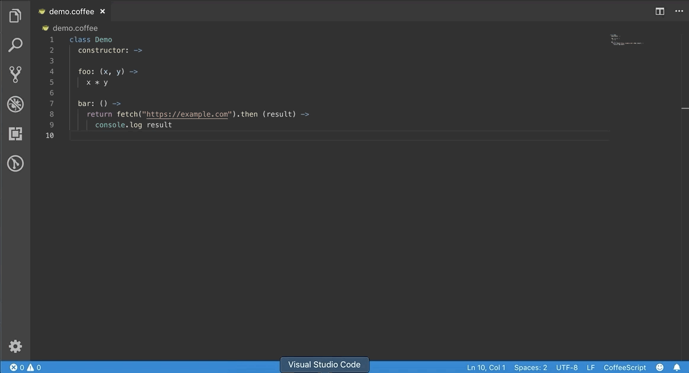

# VS Code toTypeScript()

Convert JavaScript/CoffeeScript to TypeScript!

When `toTypeScript()` is run on JavaScript or CoffeeScript files, a TypeScript version of the file is created with TypeScript [Quick Fixes](https://code.visualstudio.com/docs/languages/typescript#_quick-fixes) applied to the newly created source.

## Usage
Converting JavaScript

Converting CoffeeScript

**Note:** When `toTypeScript()` is run for CoffeeScript, the source is initially converted to JavaScript using [decaffeinate](https://github.com/decaffeinate/decaffeinate), then converted to TypeScript.

## toTypeScript() Settings

toTypeScript provides the following configurations representing TypeScript [Quick Fixes](https://code.visualstudio.com/docs/languages/typescript#_quick-fixes) that will be run when converting files to TypeScript:

| Setting name | Description |
| --- | --- |
| `toTypeScript.inferFromUsage` |  Infer variable type from usage - default: `true`  |
| `toTypeScript.convertToAsyncFunction` | Rewrite functions that use `.then` Promise chaining to use `async` and `await` - default: `true`  |
| `toTypeScript.addMissingMember` | Declare missing class members - default: `true`|
| `toTypeScript.forgottenThisPropertyAccess` | Add `this.` to unresolved variables - default: `true`  |
| `toTypeScript.fixAwaitInSyncFunction` | Add `async` modifier to containing functions using `await` - default: `true`  |
| `toTypeScript.fixExpectedComma` | Replace `;` to `,` within a list. - default: `true`  |
| `toTypeScript.requireInTs` | Convert `require` to `import` - default: `true`  |
| `toTypeScript.fixUnreachableCode` | Remove unreachable code - default: `true`  |
| `toTypeScript.fixUnusedLabel` | Remove unused labels - default: `true`  |

## Release Notes

### 0.2.1

- Update dependencies.

### 0.2.0

- Update dependencies

- Add the "Fix Expected Comma" codefix to list of refactors

- Bump vscode extension compatibility version to `^1.47.0`

### 0.1.2

- Update dependencies.

### 0.1.1

- Update dependencies.

### 0.1.0

- Initial release.
